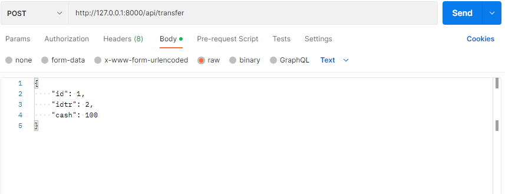
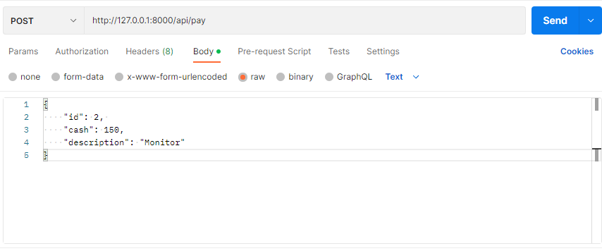
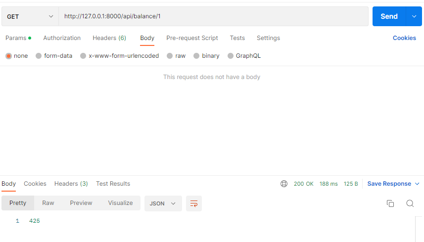
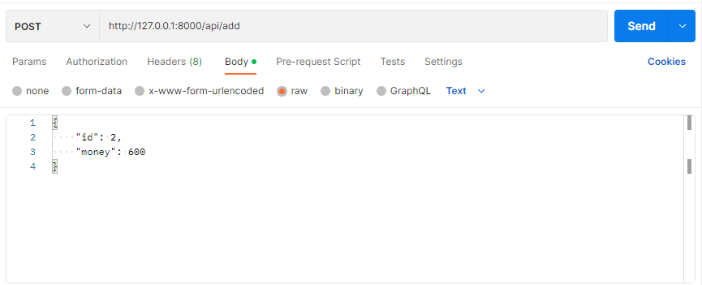
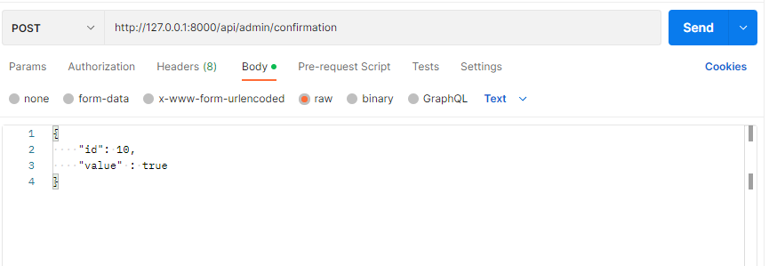

# Avito Test
___
### start 

First, we build the project using **docker-compose**.
```azure
docker compose up --build 
```
We use the command exec where we run the db.sql file.
```azure
docker exec -i {container_db_id} psql -U postgres < db.sql
```
___
### Description of methods

*transferMoney* - transfers money from user to user. The input takes the *Id* of the user from whom the money is withdrawn and the *Id* of the user to whom the money is transferred, and the last argument is *money* (how much to transfer).

***request example:***



*pay* - method allows you to place orders. The input accepts the user's *Id*, *cash* - how much he paid, *description* - details of the purchase. The method reserves a transaction in the **Buffer** table.

***request example:***



*getBalance* - returns the user's balance. In **URL** arguments it takes an *Id* parameter.

***request example:***


*addMoney* - adds the specified amount of money to the balance. Accepts the user's *Id* and *money* - the amount.

***request example:***



*confirmation* - a method that confirms the transaction and money is credited to the admin account (in this case, Avito). As input, it takes the transaction *id* in the **Buffer** table and *value* - a boolean value responsible for confirming or refusing the transaction.

***request example:***
